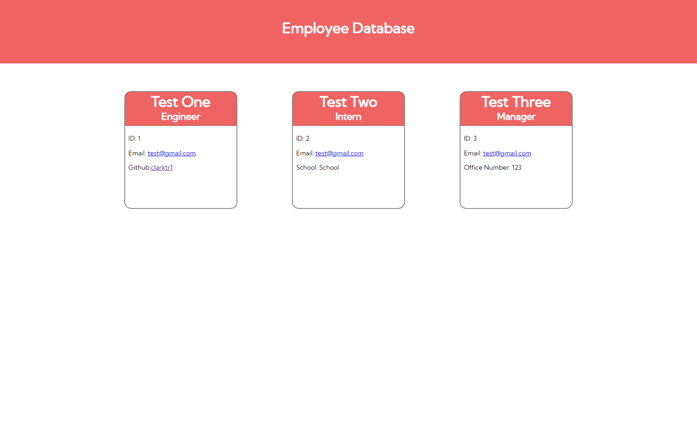

# 10 Object-Oriented Programming: Team Profile Generator


## Description

This project is a CLI Application that takes in inputs and generators an efficient and clear roster of employees. This project utilizes the functionality of objects and object-oriented programming. 

## Installation

You must have the inquirer node package to have this app operational.

```bash
  npm i inquirer
```
    
## Deployment

To deploy this project run

```bash
  node index.js
```


## Demo

https://youtu.be/JW2682zQPkU


## Screenshots





